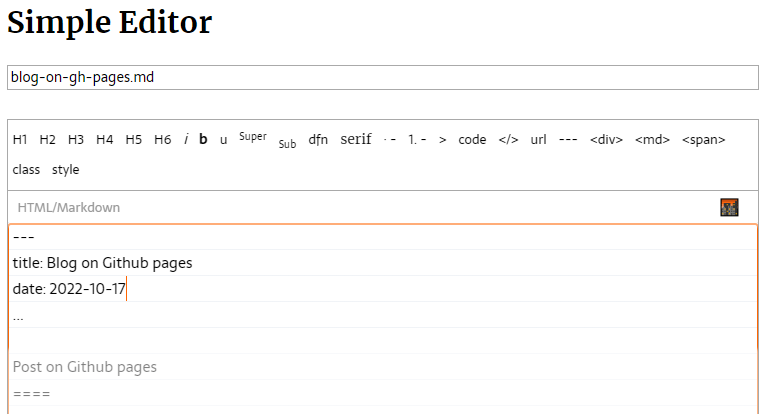
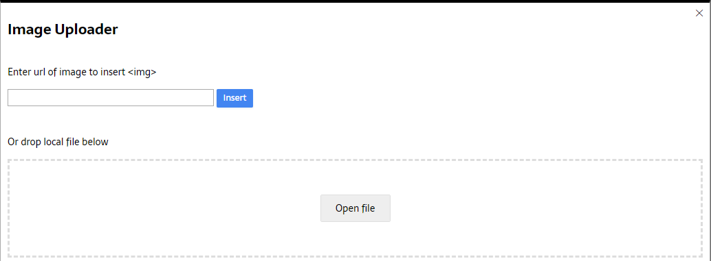
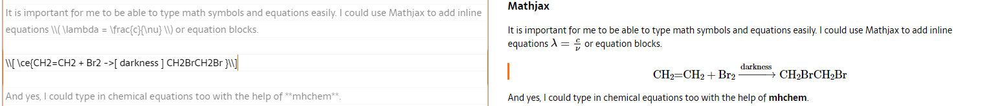
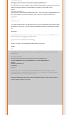

---
title: Blog on GitHub pages
date: 2022-10-17
...

Post on GitHub pages
====

In this post, I'll describe how I setup a blog on GitHub pages, and use my [Simple Editor](https://simple-editor.xyz "Simple Editor") to write a post and publish it to the blog.

Setup a blog
----

First of all, I created a new repository on GitHub with the name **\[username\].github.io**, which would be used to host all posts and static files for the blog.

In the **Settings**, I navigated to the **Pages** tab and selected the _main_ branch to build the blog.

Now the blog has been setup successfully. I simply cloned the repo onto my local laptop and started writing posts.

### Enable syntax highlighting

In the root folder, I created a `_config.yml` file in the root directory to make necessary configurations and to enable syntax highlighting.

```yaml
remote_theme: pages-themes/slate@v0.2.0
plugins:
- jekyll-remote-theme
# Jekyll 3 now only supports Kramdown for Markdown
kramdown:
    # Use GitHub flavored markdown, including triple backtick fenced code blocks
    input: GFM
    # Jekyll 3 and GitHub Pages now only support rouge for syntax highlighting
    syntax_highlighter: rouge
    syntax_highlighter_opts:
        # Use existing pygments syntax highlighting css
        css_class: 'highlight'
```

### Enable Mathjax

In order to enable _Mathjax_ support with _mhchem_, I created a `/_includes` directory in my repo, and uploaded a file named as `head-custom.html` with the following code to this directory.

```html
<script type="text/javascript" crossorigin="anonymous" src="https://polyfill.io/v3/polyfill.min.js?features=es6"></script>
<script>
  MathJax = {
    loader: {
      load: ['[tex]/autoload']
    },
    tex: {
      packages: {
        '[+]': ['autoload']
      },
      inlineMath: [['\\(', '\\)']]
    },
    svg: {
      fontCache: 'global'
    },
    chtml: {
      scale: .9,
      minScale: .5,
      mtextFont: '',
      unknownFamily: 'serif',
      mathmlSpacing: false,
      exFactor: .5
    }
  };
</script>
<script type="text/javascript" id="MathJax-script" async crossorigin="anonymous" src="https://cdn.jsdelivr.net/npm/mathjax@3/es5/tex-chtml-full.js"></script>
```

### Posts directory

Jekyll requires uploading post `.md` files to the `/_posts/` folder and all static files including images to the `/assets/` directory. Therefore, if I want to load an image in the post, I have use `/assets/[path_to_image].jpg` as the url.

However, I wouldn't use this structure. Instead, I created a `/posts/` directory, and all the files (`.md` and images) for my posts would be stored there with a subdirectory `/posts/[date_of_post_in_YYYY-mm-dd]/` for each individual post.

I believe this is a better way of organizing the files. My `.md` files could simply load the images using `[filename_of_image]` as the source url, and contents of my `.md` files will be independent of directory structures. This allows me to focus on the contents alone, without worrying about the directory structures.

It also greatly reduces the hassle in transferring a single post as I could just zip the entire subdirectory for the post which would contain all necessary files. Meanwhile, when I want to delete the post, I could simply delete the subdirectory too. I don't need to read through the post to find out what images to delete.

With my directory structure, Jekyll will be able to process my posts as `pages` and serve the html using the url `/posts/YYYY-mm-dd/[name_of_md_file].html`.

### List of posts

As I said, Jekyll would process my posts as `pages`. As a result, I couldn't make a list of `posts` but I have to list `html_pages`. So in my `/index.md`, I put the following contents so that Jekyll will generate a list of `html_pages` as my posts.

```


{{ page.title }}
{{ page.date | date: "%B %e, %Y" }}


```

Write a post
----

Now I could start to write a post using my [Simple Editor](https://simple-editor.xyz "Simple Editor").

### YAML Front matter

I'll add a YAML Front matter so that I could define title and date of post.

<figure markdown="1">
<span style="display:block;margin-left:auto;margin-right:auto;max-width:auto;">

</span>
<figcaption markdown="1">
</figcaption>
</figure>

At the same time, I would set the file name of the `.md` file so that it would give a nice and human-readable slug for my post.

I would then continue typing the post. All standard Markdown features would be available either by typing out the syntax or using the buttons above the editing area.

### Image

There would be many ways that I could use to add or upload images.

#### Remote image

I would simply use the Markdown syntax, `` to load an external image. Or I can use the **Image Uploader** to insert the image.

<figure markdown="1">
<span style="display:block;margin-left:auto;margin-right:auto;max-width:auto;">

</span>
<figcaption markdown="1">
</figcaption>
</figure>

#### Upload image

Alternatively, I would upload images by drag-and-drop or by clicking on the _Open file_ button.

Images that I uploaded would be saved to the browser's `indexedDB` so that deleting the local file would not affect my post.

I can even upload files of other types using this uploader, and the file uploaded will be available as a link for my reader to download.

#### Unsplash images

What I love the most about this uploader is the support for Unsplash images.

<figure markdown="1">
<span style="display:block;margin-left:auto;margin-right:auto;max-width:auto;">

</span>
<figcaption markdown="1">
</figcaption>
</figure>

I could search for any keyword and then simply click on the image to insert it into my post, like the one shown below. It would generate a `caption` where the author and a link to the image on Unsplash would be included.

<figure markdown="1">
<span style="display:block;margin-left:auto;margin-right:auto;max-width:auto;">

</span>
<figcaption markdown="1">
Photo by <a href="https://unsplash.com/@goumbik" target="_blank" title="Author">Lukas Blazek</a> on <a href="https://unsplash.com/photos/GnvurwJsKaY" target="_blank" title="Unsplash">Unsplash</a>
</figcaption>
</figure>

#### Paste images

I could also just paste images in the text box while typing the post. The image would be automatically saved and inserted into the post. So I could just screenshot and paste without saving and then deleting the image file.

### Mathjax

It is important for me to be able to type math symbols and equations easily as a chemistry teacher. I could use Mathjax to add inline equations \\( \lambda = \frac{c}{\nu} \\) or equation blocks using `\\( \\)` or `\\[ \\]` as delimiters respectively.

\\[ \ce{CH2=CH2 + Br2 ->[ darkness ] CH2BrCH2Br }\\]

And yes, I could type in chemical equations too thanks for the help of **mhchem** extension. I would simply wrap any chemical formula or equations using `\ce{}`.

Preview
----

All the editing will be shown in the **preview panel** in real-time, with the images, code syntax highlighting, and equations all updated.

<figure markdown="1">
<span style="display:block;margin-left:auto;margin-right:auto;max-width:auto;">

</span>
<figcaption markdown="1">
</figcaption>
</figure>

It even has a small indicator telling me which paragraph I'm currently editing.

What's more, I could click on any text in the editing area, and the preview panel would quickly scroll to the corresponding position. Even better, I could do the reverse. I click on a paragraph in the preview panel, the editing area will also scroll to where that paragraph is.

Beside the preview panel, there is another small **overview panel** that would show the entire post with a highlight to where I'm editing or scrolling to. Whenever I scroll the editing area, this little overview panel would popup on the right of the screen and show me where my position is in the entire post.

<figure markdown="1">
<span style="display:block;margin-left:auto;margin-right:auto;max-width:auto;">

</span>
<figcaption markdown="1">
</figcaption>
</figure>

Of course, the preview is smart enough to ignore the YAML front matter.

Save
----

I don't need to save anything because the post is automatically saved in the browser's `indexedDB` as I type. Whenever I launch the browser and navigate to the [Simple Editor](https://simple-editor.xyz "Simple Editor"), the post is here to be edited.

Once I'm done editing my post, I'll be able to save it to my disk. It would give me a `.zip` file containing the `.md` file with the correct name that I set, and the images and other files that I uploaded.

### Sync

I could also continue my work on another device. All I need to do is to save the post, but not downloading the zip file, and then scan the QR code at the corner of the page to open the [Simple Editor](https://simple-editor.xyz "Simple Editor") on another device. The QR code is basically a url with an identifier that allows the new device to download the saved post.

### Import

Or I could save the zip file locally and transfer it to another device using anything such as email / airdrop / whatsapp / dropbox etc. And then I can just open the [Simple Editor](https://simple-editor.xyz "Simple Editor") on that device and import the zip file. All post contents as well as images and files will be there.

Publish
----

After I'm done, I would save the zip file, then unzip all the files inside to the repo for my blog. I'll follow my directory structure, save the files into `/posts/YYYY-mm-dd/` folder. GitHub pages would then automatically regenerate the site, and a new post would go alive.
